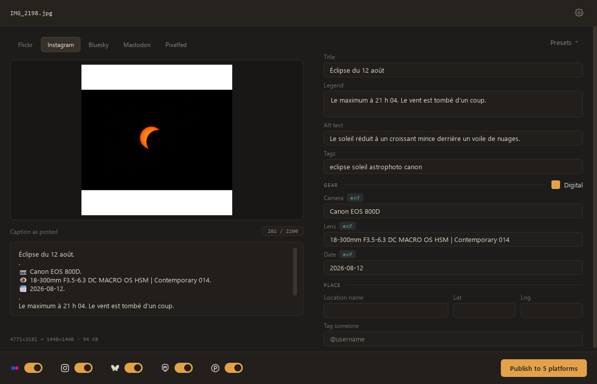
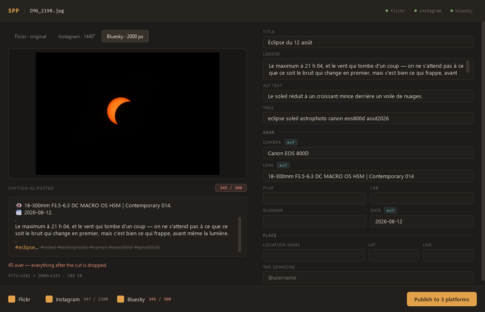

# SPP — Simple Photo Poster

Post one photograph to Flickr, Instagram and Bluesky in a single pass — resized
the way each platform wants it, captioned the way each platform counts.



## The problem it solves

Posting the same picture in three places is three different jobs. Instagram
wants a square, Bluesky wants the full frame under a megabyte, Flickr wants the
original untouched. Instagram allows 2200 characters, Bluesky 300 — and counts
them in graphemes, so an emoji weighs one, not four. Do it by hand and you
retype the same caption three times; do it with a script and you find out what
got mangled after it is already public.

SPP composes the post once and shows you, per platform, **the picture that will
actually be sent and the caption that will actually be published** — before you
publish anything.

## What it does

**Shows the real thing, not an approximation.** The left half of the window is
the `prepare()` step made visible. The picture in the preview is the file that
will be uploaded; the caption is the string that will be posted. No network
call is involved, so it costs nothing to look.

**Tells you where a caption gets cut.** Bluesky's 300-grapheme limit is easy to
overshoot once the gear block is in. The preview strikes through exactly what
will be dropped — usually the hashtags, which is precisely what you would want
to know beforehand.



**Fills in what it can.** Camera, lens, capture date and GPS coordinates come
from the picture's EXIF. Film, lab and scanner — which no camera writes — are
carried over from your last post. Every pre-filled field says where its value
came from, and typing over it is the whole interaction.

**Fails one platform at a time.** A platform that is down, unconfigured, or
missing its client library never takes the others with it. The window greys it
out and says why before you start; the run reports each platform separately.

## Platforms

| Platform  | Picture sent | Caption limit | Credentials |
|-----------|--------------|---------------|-------------|
| Flickr    | the original, untouched | none | API key + secret |
| Instagram | 1440×1440, centred on white | 2200 characters | account login, or a browser `sessionid` |
| Bluesky   | full frame at 2000px, under 1MB | 300 graphemes | handle + app password |

Bluesky posts carry real hashtag facets, alt text, the image aspect ratio and
the caption language. Instagram posts carry the location and a user tag.

Twitter/X was dropped in 2023 along with API v1.1. The publisher is still in the
history if it is ever worth porting to v2.

## Install

Python 3.9 or later.

```
python -m venv .venv
.venv/Scripts/activate        # Linux/macOS: source .venv/bin/activate
pip install -r requirements.txt
```

## Configure

Credentials live in a git-ignored `.env` at the root of the project:

```
cp .env.example .env
```

Fill in only the platforms you use — the others are simply skipped, with a
reason shown rather than an error. `SPP_PLATFORMS` narrows the default
selection, `SPP_LANGS` sets the language your captions are written in
(defaults to `fr`).

## Use

```
python spp_gui.py                 # the window
python spp_gui.py shot.jpg        # opens straight on that picture
```

Drop a photo on the window, or drag one from your file manager.

The command line does the same job without the preview, and is the better
choice when you already know what you are posting:

```
python photopost.py                                  # asks for everything
python photopost.py shot.jpg --dry-run               # prepares and shows, posts nothing
python photopost.py shot.jpg -p flickr,bluesky       # only these two
```

`--dry-run` prepares every image and prints every caption without touching the
network. The exit code is non-zero if any platform failed.

## How it works

```
libs/
  config.py       credentials and paths, read from .env when first needed
  post.py         one Post object: the picture and everything said about it
  images.py       resizing, EXIF orientation, per-platform size caps
  exif.py         camera, lens, date and GPS read back from the file
  lastpost.py     film, lab and scanner carried over
  runner.py       a publishing run, as a stream of events
  publishers/     one module per platform
  gui/            the window; it drives the publishers, it does not duplicate them
```

The window and the CLI consume the same `runner.run()` event stream and the
same publishers, so the preview cannot drift from what actually gets posted.

### Adding a platform

One module in `libs/publishers/` implementing three methods —
`credentials()`, `prepare_image()` and `publish()` — plus whatever it caps
(`limit`, `measure`, `split_text`) and the library it needs (`requires`).
List it in `libs/publishers/__init__.py`. Nothing else in the project changes,
window included.

## When Instagram asks for a verification

`instagrapi` drives the private mobile API, so a first login from an unknown
device is often answered with `ChallengeRequired`. The checkpoint is bound to
*that device*: clearing it in a browser does not clear it for the library, and
no `challenge_code_handler` covers the native flow.

The way through is to reuse a browser session that has already been verified.
Put its `sessionid` cookie in `INSTAGRAM_SESSIONID` (Firefox: F12 → Storage →
Cookies → instagram.com → sessionid) and it is used instead of the password.
Treat it as a credential: it expires, and logging that browser out revokes it.
Use the same machine and connection as the browser.

## Roadmap

### More platforms

- **Twitter/X, back on API v2.** The v1.1 publisher is still in the history
  (`git log --full-history -- libs/publishers/twitter.py`), along with its weighted character
  count, so this is a port to `tweepy`'s `create_tweet` rather than a rewrite.
  It needs a developer account, and the free tier is write-only and capped —
  worth checking the current terms before counting on it.
- **Mastodon and Pixelfed.** Documented public APIs, no application to file:
  the cheapest platforms left to add.
- **Facebook.** Wanted since the very first todo list, never actually wired up.

### Publishing

- **Retry a single platform from its row.** When one fails, the run dialog
  still holds everything needed to try again — the post, and the picture
  already prepared. A Retry button on that row, instead of a dead end and a
  full recompose.

### Composing a post

- **Remember what has been typed, and suggest it back.** Every camera, lens,
  film, lab and scanner ever entered goes into a list that survives closing the
  app; typing `Ilf` offers `Ilford Delta 100`. A superset of the values already
  carried over from the last post, which only remembers the most recent one.
- **Save as preset.** A button opening a small dialog: name the preset, tick
  the fields it should carry, save. Recalled from a list when composing —
  a body and a film you come back to, rather than whatever you did last.
- **A digital / film switch.** One checkbox hiding the film, lab and scanner
  fields, which mean nothing on a digital frame and only crowd the form.
- **Set that switch from the EXIF.** A file carrying a lens, an aperture and an
  ISO was almost certainly shot digitally, so the box can start ticked and keep
  the film fields out of the way. A guess, never a verdict: a scan often
  carries its *scanner's* EXIF and looks digital, so the box stays yours to
  untick.

### Shipping a 1.0

- **A settings screen, and a home under the user's own data directory.**
  Credentials sit in a `.env` beside the source, which is fine for whoever
  cloned the repository and impossible for anyone else. They need a screen in
  the window instead. The same goes for the working folders: a bundled app
  cannot assume it may write next to its own executable.
- **Capture the Instagram session in the app.** A Qt WebEngine view on
  Instagram's login page, the challenge completed inside it, and the
  `sessionid` read straight off the cookie store — nobody has to know what a
  cookie is, or open devtools. Everything needed already ships with PySide6,
  persistent profile included, so the session survives a restart. Embedding
  Chromium costs some 450 MB in the package: a deliberate price, since asking
  a stranger to copy a cookie out of Firefox is not a flow that ships.
- **One executable, downloaded and double-clicked.** PyInstaller over the
  window, with an icon and a version stamped in. It will be a heavy download —
  Qt and the bundled Chromium see to that, and measuring the real figure is
  part of the work. Windows SmartScreen will warn about an unsigned binary
  until a signing certificate is paid for.
- **A tagged 1.0 release.** A version number in the code, a GitHub Release with
  the build attached and notes saying what works — built by a workflow rather
  than by hand on one machine, so the download matches the tag.

### After 1.0

- **Instagram's official Content Publishing API**, in place of `instagrapi`.
  It would retire the challenge, the sessionid and the bundled browser in one
  move: OAuth instead of a password. Access is free, a Business or Creator
  account is enough, and publishing to your own account needs no App Review.
  Two things make it later rather than now. It accepts no file upload at all —
  the picture must sit at a public HTTPS URL that Meta fetches, which a desktop
  app has nowhere to put, unless the Flickr upload runs first and lends its
  URL. And letting anyone else sign in with their own account needs Advanced
  Access, which means App Review and business verification. Worth checking at
  the same time whether the location and the user tag survive the move.
- **A queue.** Prepare several pictures, then publish them in one go, rather
  than one window session per photograph. It turns a single-post window into a
  list beside an editor, which is most of the interface reworked — for a habit
  that is, so far, one photograph at a time.
- **Scheduled posts.** Publishing at six in the evening means something has to
  be running at six in the evening. Either the window stays open, which is not
  really scheduling, or it takes a headless mode, a queue that outlives a
  restart, a system task to wake it, and somewhere for a failure to be seen
  when nobody is watching. It builds on top of the queue rather than beside it,
  and it is the heaviest item here — which is why it comes after 1.0 rather
  than in it.

## License

MIT — see [LICENSE](LICENSE).
